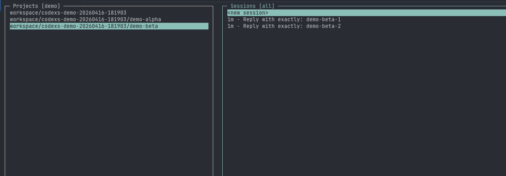

# codexs

[English README](./README.md)

`codexs` 是一个面向 OpenAI Codex CLI 的项目感知型启动工具，主要服务于 Linux 无 GUI 的终端开发环境。它的目标是降低在 headless Linux、远程机器、SSH、tmux 等场景下进行 Codex 多项目开发时的切换成本：快速选项目、恢复正确会话，并用命令行维护项目路径配置。

它现在适合直接在 Linux 终端里工作，也适合作为未来桌面端远程连接 Linux 工作流成熟之前的一套轻量方案。



## 解决什么问题

当你在纯 Linux 终端环境下跨多个仓库使用 Codex 时，默认工作流通常很重复：

- 需要记住正确的项目路径
- 需要先手动 `cd`
- 希望恢复会话时只看到当前项目的历史
- 希望用统一方式维护多个项目目录
- 希望这套流程在 SSH、tmux、无图形界面的环境里也顺手

`codexs` 把这些问题收敛成一个统一入口。

## 功能概览

- 在选定项目目录中启动 Codex
- 恢复会话时按项目目录过滤
- 同时对齐进程真实 `cwd` 和 Codex 的 `-C`，保证交互式 `/resume` 行为正确
- 默认附加 `--yolo`，但显式传入 `--sandbox` 时自动关闭
- 支持 curses、`fzf`、`whiptail` 和纯终端回退
- 提供 `codexs repo list|add|remove` 项目路径管理功能
- 使用标准 Linux 风格的 `prefix/bin/libexec/share` 安装布局
- 按 XDG 规范生成用户配置

## 仓库结构

```text
.
├── bin/codexs
├── libexec/codexs/codexs-picker
├── share/bash-completion/completions/codexs
├── share/codexs/config.example
├── codexs-install.sh
├── codexs-uninstall.sh
├── INSTALL.md
├── README.md
├── README.zh-CN.md
├── LICENSE
└── .gitignore
```

## 运行依赖

必需：

- Linux
- `bash`
- `python3`
- 已安装并可执行的 OpenAI `codex` CLI

可选：

- `fzf`，强烈建议默认安装，以获得最佳选择器体验
- `whiptail`，作为回退交互方案

resume 功能还依赖本地 Codex 状态文件，例如：

- `~/.codex/state_5.sqlite`
- `~/.codex/sessions`
- `~/.codex/session_index.jsonl`
- `~/.codex/history.jsonl`

## 安装

默认用户级安装：

```bash
./codexs-install.sh
```

安装并校验：

```bash
./codexs-install.sh --verify
```

仅预览安装动作：

```bash
./codexs-install.sh --dry-run --verify
```

安装时初始化项目路径：

```bash
./codexs-install.sh \
  --project-dir ~/foo-project-a \
  --project-dir ~/foo-project-b \
  --workspace-root ~/foo-workspace
```

常用安装参数：

- `--prefix DIR`
- `--bindir DIR`
- `--libexecdir DIR`
- `--datadir DIR`
- `--bash-completion-dir DIR`
- `--config-home DIR`
- `--project-dir PATH`
- `--workspace-root PATH`
- `--force-config`

### 默认安装路径

默认前缀下，文件会安装到：

- `~/.local/bin/codexs`
- `~/.local/libexec/codexs/codexs-picker`
- `~/.local/share/bash-completion/completions/codexs`
- `~/.local/share/codexs/config.example`
- `~/.config/codex-launch/config.example`

如果 `~/.config/codex-launch/config` 不存在，安装器会基于模板自动创建；如果已存在，则默认保留，除非使用 `--force-config`。

## 给 Codex 代理的安装说明

如果由另一个 Codex 实例来帮助用户安装，请先阅读 [INSTALL.md](./INSTALL.md)。

这个文档会要求代理：

- 先检查依赖
- 先问用户希望使用哪些项目目录和工作区根目录
- 先问是否保留已有配置
- 解释缺失依赖和安装影响
- 先做 dry-run 再执行真实安装

## 卸载

预览卸载动作：

```bash
./codexs-uninstall.sh --dry-run
```

删除已安装文件：

```bash
./codexs-uninstall.sh
```

连同用户配置一起删除：

```bash
./codexs-uninstall.sh --purge-config
```

## Shell 配置

确保二进制目录在 `PATH` 中：

```bash
export PATH="$HOME/.local/bin:$PATH"
```

启用 Bash 补全：

```bash
source "$HOME/.local/share/bash-completion/completions/codexs"
```

## 基本用法

交互式选择项目：

```bash
codexs
```

直接进入项目：

```bash
codexs ~/foo-workspace/foo-project
```

强制恢复最近会话：

```bash
codexs --resume
```

强制新建会话：

```bash
codexs --no-resume
```

向 Codex 透传额外参数：

```bash
codexs ~/foo-workspace/foo-project -- --search
```

显式指定 sandbox，此时默认 `--yolo` 会被关闭：

```bash
codexs ~/foo-workspace/foo-project --sandbox workspace-write
```

## 项目路径管理

`codexs repo` 管理的是配置文件里的项目路径，不是 git remote。

查看当前配置的项目路径和工作区根目录：

```bash
codexs repo list
```

新增一个或多个固定项目路径：

```bash
codexs repo add ~/foo-project-a ~/foo-project-b
```

删除一个或多个固定项目路径：

```bash
codexs repo remove ~/foo-project-a
```

这些命令会更新：

- `PINNED_DIRS`
- `WORKSPACE_ROOTS` 会由 `repo list` 一并展示，但默认仍通过配置文件或安装参数初始化

## 配置

用户配置路径：

```text
~/.config/codex-launch/config
```

示例：

```bash
# AUTO_RESUME=ask|always|never
AUTO_RESUME=ask
RECENT_LIMIT=10
DEFAULT_YOLO=1

PINNED_DIRS=(~/foo-project-a ~/foo-project-b)
WORKSPACE_ROOTS=(~/foo-workspace)
```

支持的配置项：

- `AUTO_RESUME`
- `RECENT_LIMIT`
- `DEFAULT_YOLO`
- `FZF_OPTS`
- `NEWT_COLORS`
- `PINNED_DIRS`
- `WORKSPACE_ROOTS`

## 项目发现机制

候选目录来自：

1. `~/.local/state/codex-launch/recent_projects`
2. `PINNED_DIRS`
3. `WORKSPACE_ROOTS` 下一层子目录

会自动去重，并尽量保留顺序。

## 会话发现机制

- `codexs-picker` 读取 `~/.codex/state_5.sqlite`
- launcher 还带有一套 JSONL reader，用于读取 `~/.codex/sessions`、`session_index.jsonl` 和 `history.jsonl`

两条路径最终都会按项目目录过滤。

## 默认启动行为

启动 Codex 时，`codexs` 会：

- 先切换进程 `cwd` 到目标项目
- 再传入 `-C <selected_dir>`
- 默认追加 `--yolo`
- 如果显式传入 `--sandbox` 或 `-s`，则关闭默认 `--yolo`

这样做是为了保证像 `/resume` 这样的交互式命令也能按正确目录过滤。

## 开发检查

```bash
bash -n bin/codexs
bash -n codexs-install.sh
bash -n codexs-uninstall.sh
python3 -m py_compile libexec/codexs/codexs-picker
./codexs-install.sh --dry-run --verify --project-dir ~/foo-project-a --workspace-root ~/foo-workspace
./codexs-uninstall.sh --dry-run
```

## 说明

- `fzf` 是外部依赖，正常安装时强烈建议一并装上
- 项目当前主要面向 Linux
- 只提供 Bash 补全
- 工作区扫描有意保持为一层目录

## 免责声明

本项目代码全部由 Codex 生成，尚未经过完整的端到端测试。如果你准备在自己的环境中长期使用，请先自行审阅，并按需要 fork 后调整。
